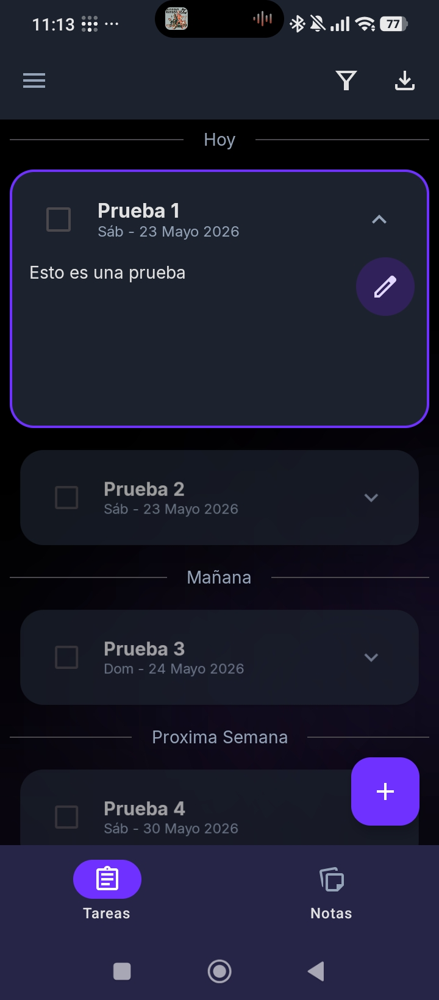
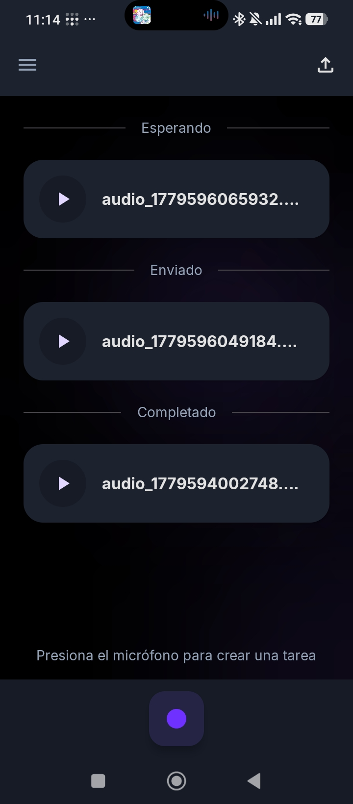
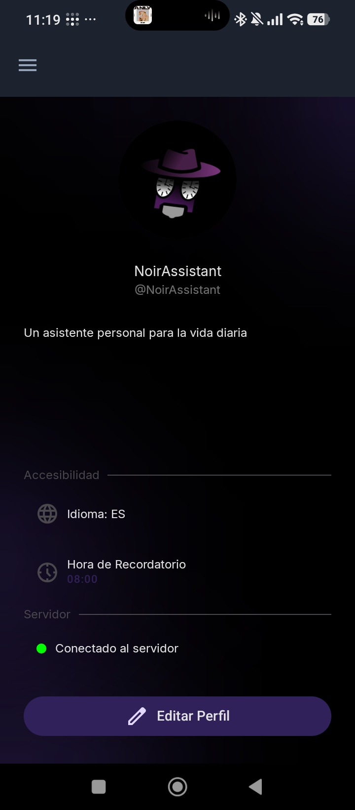
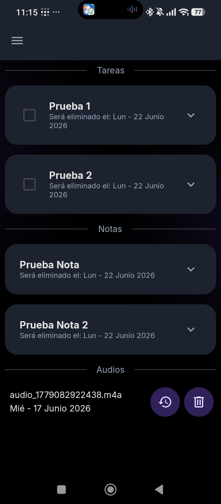
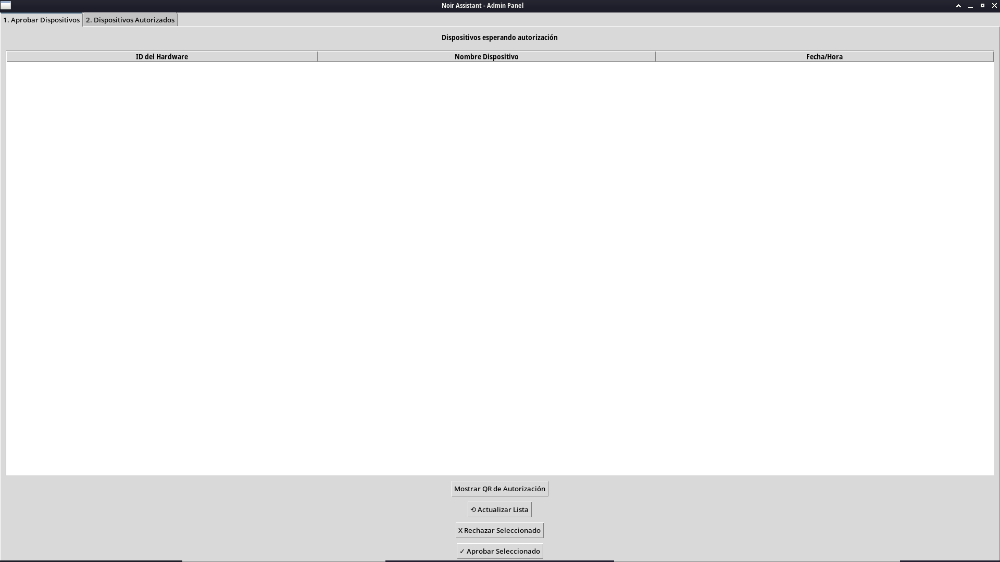
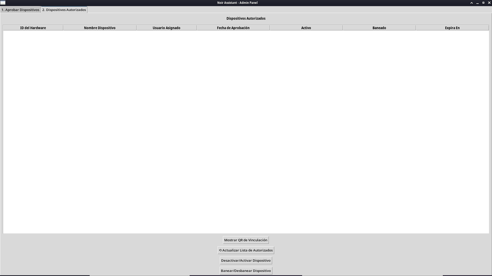

# Noir Assistant V2.0.1

**Noir Assistant** es una plataforma personal de captura y organización de información diseñada bajo una arquitectura *offline-first*, modular y reactiva.

Su objetivo es permitir que el usuario registre información de forma rápida y natural mientras mantiene control local sobre sus datos, configuración y flujo de trabajo.

La aplicación combina un cliente Android moderno desarrollado con Jetpack Compose junto a una infraestructura de procesamiento desacoplada para ofrecer:

* Gestión de tareas y notas.
* Captura de información mediante audio.
* Procesamiento remoto de voz a texto.
* Persistencia local como fuente principal de datos.
* Procesamiento de audio bajo demanda mediante servicios especializados.
* Funcionamiento resiliente ante interrupciones de conectividad.

Uno de los pilares del proyecto es la soberanía de los datos. Noir Assistant no depende de servicios propietarios obligatorios ni de infraestructuras centralizadas. El usuario puede desplegar y administrar su propio servidor, manteniendo control sobre la infraestructura utilizada por el sistema y conservando la información persistente dentro de su dispositivo.

La arquitectura adopta un modelo donde el cliente Android constituye la fuente principal de datos y estado de la aplicación. Los servicios remotos actúan exclusivamente como proveedores de capacidades especializadas de procesamiento y no como repositorios centrales de información.

Este enfoque permite reducir dependencias permanentes de conectividad, mejorar la resiliencia operativa y mantener una experiencia consistente incluso cuando la infraestructura remota no se encuentra disponible.

**La versión `2.0.0` introduce una evolución completa de la arquitectura incorporando procesamiento remoto desacoplado de audio, autenticación modular, persistencia reactiva unificada y una refactorización integral orientada a escalabilidad, mantenibilidad y resiliencia.**

## Funcionalidades Cliente Android

### Gestión de Tareas y Notas

La aplicación centraliza tareas y notas dentro de una experiencia unificada, rápida y consistente, diseñada para minimizar distracciones y facilitar la organización diaria.

- Creación y edición rápida mediante diálogos unificados
- Organización temporal de actividades y contenido
- Sistema de eliminación reversible con papelera integrada
- Interacciones optimizadas mediante gestos y acciones rápidas
- Persistencia local robusta y reactiva
- Actualización reactiva automática de contenido

---

### Captura Inteligente de Audio

Noir Assistant permite capturar información mediante notas de voz y solicitar su procesamiento cuando el usuario lo considere necesario.

Las grabaciones permanecen almacenadas localmente dentro del dispositivo. El servidor no almacena ni administra la información persistente de la aplicación; únicamente proporciona capacidades especializadas de procesamiento de audio bajo demanda.

- Grabación de audio integrada
- Solicitud de procesamiento bajo demanda
- Conversión de voz a estructuras organizadas
- Cola local persistente para solicitudes
- Recuperación automática ante fallos
- Persistencia reactiva y resiliente

---

### Experiencia de Usuario

La experiencia de usuario fue diseñada bajo una filosofía reactiva y offline-first, priorizando fluidez, claridad visual y continuidad operativa incluso ante cambios de conectividad o reinicios del sistema.

#### Personalización e Internacionalización

- Cambio dinámico de idioma dentro de la aplicación
- Personalización de perfil e identidad visual
- Configuración persistente de preferencias
- Sistema de foto de perfil con edición interactiva

#### Recuperación y Protección de Información

- Papelera integrada para contenido eliminado
- Restauración de tareas, notas y audios
- Protección ante eliminaciones accidentales
- Conservación temporal antes de eliminación definitiva

---

### Procesamiento Desacoplado y Resiliencia

Noir Assistant adopta una arquitectura donde el dispositivo constituye la fuente principal de verdad para toda la información del usuario.

Tareas, notas, audios, configuraciones y estados permanecen almacenados localmente mediante mecanismos de persistencia reactiva.

La infraestructura remota no participa como repositorio de datos. Su responsabilidad consiste únicamente en ofrecer capacidades especializadas que pueden ser invocadas bajo demanda cuando el usuario necesita procesamiento adicional.

Este enfoque permite:

- Persistencia local como fuente principal de datos
- Funcionamiento continuo sin dependencia permanente del servidor
- Procesamiento especializado bajo demanda
- Recuperación automática de estado tras reinicios
- Gestión resiliente de conectividad
- Estados globales de infraestructura
- Reducción de puntos únicos de fallo
- Mayor control sobre los datos del usuario

---

### Sistema de Recordatorios Persistentes

La aplicación incorpora un sistema de recordatorios diseñado para mantener continuidad operativa incluso ante reinicios del dispositivo o cierres inesperados.

- Recordatorios diarios configurables
- Reprogramación automática tras reinicios
- Notificaciones persistentes
- Ejecución resiliente en segundo plano

## Funcionalidades Servidor

### Administración de Dispositivos

El servidor incorpora una consola administrativa que permite controlar qué dispositivos pueden acceder a la infraestructura de procesamiento de Noir Assistant.

Toda solicitud de acceso requiere aprobación explícita por parte del administrador, garantizando que únicamente los dispositivos autorizados puedan utilizar los servicios ofrecidos por el servidor.

- Visualización de solicitudes de acceso pendientes.
- Aprobación o rechazo manual de dispositivos.
- Identificación individual de las solicitudes mediante informacion del hardware que solicita autorizacion.
- Generación de códigos QR efimeros reclamables para procesos de autorización.
- Registro temporal de solicitudes en espera.
- Gestión centralizada de solicitudes en espera.

Este enfoque permite mantener una infraestructura privada donde el propietario conserva control total sobre los dispositivos que pueden utilizar el sistema.

### Gestión de Dispositivos Autorizados

Una vez autorizados, los dispositivos pueden administrarse desde una interfaz centralizada diseñada para supervisar el acceso a la infraestructura y aplicar restricciones cuando sea necesario.

- Consulta de dispositivos autorizados.
- Gestión de estados de activación.
- Bloqueo y desbloqueo de dispositivos.
- Seguimiento de autorizaciones y vigencia de credenciales.
- Generación de códigos QR para entrega de credenciales.
- Administración centralizada de múltiples dispositivos.

La consola proporciona una vista unificada del ecosistema conectado al servidor, facilitando la gestión y el control operativo.

### Procesamiento Inteligente de Audio

El servidor incorpora una infraestructura especializada para transformar notas de voz en información estructurada consumible por el cliente Android.

Los audios son procesados bajo demanda, permitiendo aprovechar recursos externos de procesamiento sin comprometer la arquitectura offline-first de la aplicación.

- Transcripción automática mediante Faster-Whisper Large.
- Conversión de voz a texto ejecutada localmente en la infraestructura del servidor.
- Generación de estructuras JSON organizadas para su consumo por la aplicación.
- Procesamiento iniciado explícitamente por el usuario.
- Arquitectura preparada para futuras etapas de interpretación y enriquecimiento de contenido.

### Infraestructura Multiplataforma

La arquitectura backend fue diseñada para ejecutarse en diferentes sistemas operativos y arquitecturas, facilitando despliegues tanto en equipos personales como en servidores de bajo consumo.

- Validado en Windows x86_64.
- Validado en Linux ARM64.
- Compatible con despliegues domésticos basados en Raspberry Pi.
- Operación tanto en entornos gráficos como en servidores headless.

## Tecnologías Utilizadas

Noir Assistant combina tecnologías modernas de desarrollo móvil, persistencia local y servicios especializados de procesamiento para construir una plataforma reactiva, resiliente, centrada en el control local de los datos y preparada para evolucionar de forma independiente en cada una de sus capas.

### Cliente Android

- **Kotlin** — Lenguaje principal de desarrollo.
- **Jetpack Compose** — Construcción de interfaces declarativas y reactivas.
- **Material Design 3** — Sistema moderno de diseño visual.
- **Room** — Persistencia local estructurada y reactiva.
- **Jetpack DataStore** — Gestión persistente de preferencias y configuración.
- **Coroutines & Flow** — Manejo asíncrono y reactivo de estados.
- **OkHttp** — Comunicación HTTP desacoplada con el backend.

---

### Backend y Procesamiento

- **FastAPI** — Backend principal y gestión de endpoints REST.
- **Python** — Procesamiento de audio y lógica de integración.
- **Rust** — Servicios críticos orientados a rendimiento y seguridad.
- **Redis** — Gestión temporal de sesiones y estados efímeros.
- **SQLite** — Persistencia ligera para servicios y metadatos del backend.
- **Faster-Whisper Large** — Conversión de voz a texto ejecutada dentro de la infraestructura de procesamiento.
- **Structured Data Pipeline** — Transformación automática de transcripciones en estructuras organizadas consumibles por la aplicación.

---

### Arquitectura y Rendimiento Android

- **MVVM + Repository Pattern** — Arquitectura modular y escalable.
- **Repository-Centric Architecture** — Coordinación desacoplada entre dominio, persistencia e infraestructura.
- **Offline-First Architecture** — Persistencia local como núcleo operativo.
- **Reactive State Management** — Propagación reactiva de estado entre persistencia, dominio y presentación.
- **Baseline Profiles** — Optimización avanzada de tiempos de arranque y ejecución.

## Requisitos del Sistema

### Cliente Android

- **Android mínimo:** Android 8.0 Oreo (API 26)
- **Target SDK:** Android 15 (API 35)
- **Java:** 17
- **Kotlin JVM Target:** 17

La aplicación fue desarrollada utilizando tecnologías modernas del ecosistema Android con una arquitectura reactiva y offline-first.

---

### Backend y Procesamiento

El backend está construido como un proveedor de servicios especializados orientado a procesamiento de audio, autenticación y gestión temporal de sesiones.

No constituye una fuente principal de persistencia para la información del usuario.

#### Stack Principal

- **Python 3.13**
- **FastAPI**
- **Rust (Edition 2021)**
- **Redis**
- **SQLite**

#### Dependencias Principales

- **Uvicorn** — Servidor ASGI para FastAPI
- **PyJWT** — Gestión de autenticación basada en JWT
- **Jinja2** — Renderizado de vistas administrativas
- **QRCode + Pillow** — Generación de códigos QR y procesamiento auxiliar de imágenes
- **PyO3** — Integración nativa entre Rust y Python

#### Procesamiento Inteligente de Audio

- **Faster-Whisper Large** — Conversión avanzada de voz a texto mediante inferencia local.
- Pipeline preparado para transformación automática de audio en estructuras JSON organizadas.

## Licencia

Este proyecto se distribuye bajo la **Licencia MIT**.

Noir Assistant sigue una filosofía de desarrollo abierta, modular y extensible, orientada a construir un asistente personal centrado en privacidad, resiliencia y control local de los datos.

---

## Documentación Técnica

La documentación técnica describe la arquitectura, persistencia, procesamiento de audio, infraestructura backend y funcionamiento interno del sistema.

### Cliente Android

* [Sistema de Datos y Persistencia](./docs/android/data_system/Data_System.md)
* [Ciclo de Vida de Notificaciones y Alarmas](./docs/android/notifications_system/Notifications_System.md)
* [Sistema de Navegacion de Pantallas](./docs/android/navigation_system/Navigation_System.md)

### Backend

* Documentación del servidor (próximamente)

---

Noir Assistant es un proyecto enfocado en construir una plataforma personal de captura y organización de información donde la persistencia local constituye la fuente principal de verdad, mientras que los servicios externos funcionan como capacidades especializadas bajo demanda.

La soberanía de los datos, la resiliencia operativa y la modularidad arquitectónica constituyen los pilares fundamentales del proyecto.